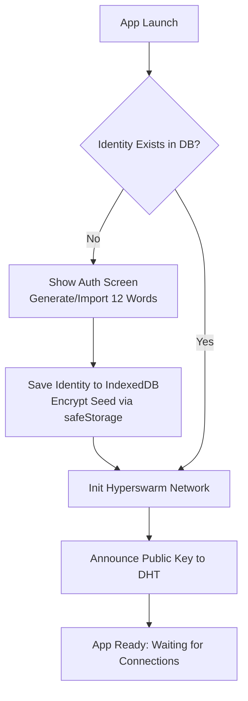
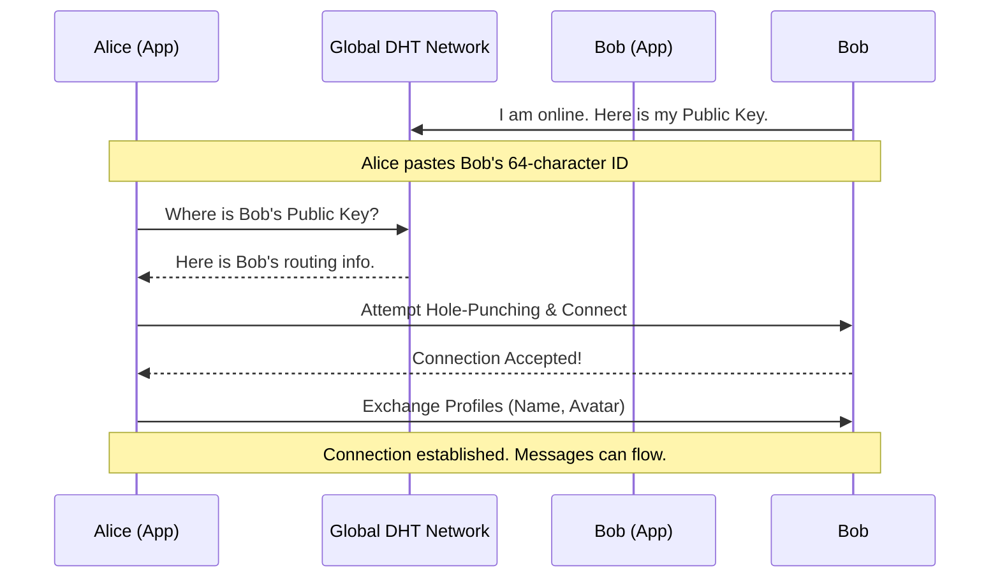
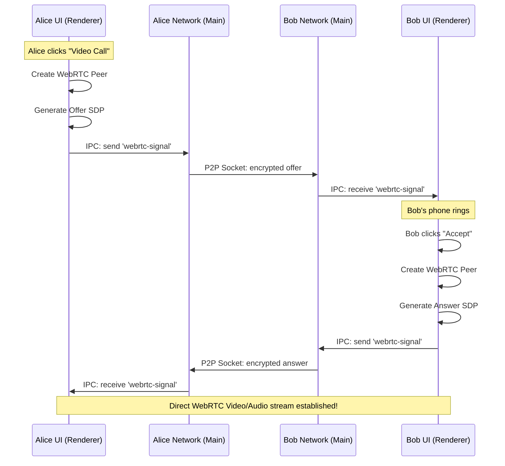

# A&Y Complete Application Manual & Architecture Guide

Welcome to the ultimate guide for **A&Y**! This document is designed to be fully comprehensive. Whether you are a non-technical person wanting to understand how the app protects your privacy, or a software engineer looking to contribute to the codebase, everything you need is right here.

---

## 📖 Part 1: For Everyone (The Non-Technical Guide)

### What is A&Y?
A&Y is a next-generation desktop application for **messaging and video calling**. It looks and feels like popular apps (such as WhatsApp, Telegram, or FaceTime), but under the hood, it operates entirely differently.

### How is it Different? (The "Serverless" Magic)
Most messaging apps rely on massive, centralized servers owned by big corporations (like Meta, Google, or Apple). When you send a message, it goes from your phone to their server, and then from their server to your friend. The corporation holds the keys, the data, and the history.

**A&Y has no servers.**
We use a technology called **Peer-to-Peer (P2P)** networking. When you send a message or start a video call, your computer connects *directly* to your friend's computer. 

### Key Concepts Explained Simply:

1. **No Central Database (Zero Data Collection)**
   There is no giant database in the sky storing your chats. Every message, contact, and setting lives **only on your device**. If you uninstall the app and wipe your computer, that data is gone forever. Nobody can hack the A&Y servers to steal your data, because there are no servers to hack.

2. **The "Secret Identity" (Your Seed Phrase)**
   When you first open the app, it generates a 12-word "Secret Recovery Phrase." Think of this as your master password and your digital DNA combined. This phrase generates your unique **User ID** (a long string of numbers and letters). You share this ID with friends so they can add you. If you lose your computer, entering those 12 words on a new computer will restore your identity (though not your past chat history, since that was only on the old computer).

3. **The Global Phonebook (The DHT Network)**
   If there are no servers, how does the app find your friend over the internet? It uses a "Distributed Hash Table" (DHT). Imagine a massive, invisible, global phonebook maintained collectively by everyone using the app. When you want to call your friend, your app asks the network, "Who knows the IP address for User ID `xyz123`?" The network safely routes you to them, and a direct connection is formed. 

4. **End-to-End Encryption**
   Everything you send is scrambled with military-grade locks before it leaves your computer. Only your friend's computer has the key to unscramble it. No middleman, internet service provider, or hacker can intercept and read the contents.

---

## 🛠 Part 2: For Developers (The Technical Architecture)

If you're diving into the code, you need to understand the stack. We use web technologies wrapped in a desktop shell, supercharged with decentralized networking libraries.

### 1. The Technology Stack
- **Electron**: The framework that packages our web code into a standalone macOS/Windows app. It gives us deep OS integration (like file system access and local databases).
- **Hyperswarm**: A magical networking module that creates a DHT (Distributed Hash Table). It handles hole-punching through home routers/NATs and creates encrypted TCP-like sockets directly between peers.
- **WebRTC (via `simple-peer`)**: The industry standard for real-time video/audio. WebRTC requires "signaling" (a way to exchange setup data before the video starts). We use our Hyperswarm sockets as the signaling channel!
- **IndexedDB**: The browser's native database, used to store all UI data (contacts, message history) locally.
- **Vanilla JS, HTML, CSS**: No React, Vue, or Tailwind. Pure, unadulterated web standards to keep the app blazing fast, lightweight, and easy to understand.

### 2. The Multi-Process Model

Electron apps are split into two halves that talk to each other via IPC (Inter-Process Communication).

#### A. The Main Process (`src/main.js`, `src/swarm.js`)
*This is the "backend" of the desktop app.*
- It has full access to the computer's OS.
- It manages window creation, menus, and application lifecycle.
- **`swarm.js`**: This is the heart of the network. It initializes Hyperswarm, manages the user's cryptographic keypair, listens for incoming connections from the global DHT, and manages direct sockets to other peers.
- **Security**: It uses the OS native keychain (via Electron's `safeStorage`) to securely save the user's 12-word seed phrase.

#### B. The Renderer Process (`src/renderer/app.js`, `src/renderer/p2p.js`)
*This is the "frontend" UI you actually see.*
- It renders the HTML/CSS and handles user clicks.
- **`localDB.js`**: Wraps IndexedDB to save and load messages and contacts.
- **`p2p.js`**: Acts as the bridge between the UI and the Main process's network. When you send a message, the UI tells `p2p.js`, which fires an IPC event to the Main process, which sends it over the Hyperswarm socket.
- **WebRTC**: All video rendering and WebRTC connection logic happens here in the renderer.

---

## 📊 Part 3: Architecture Diagrams & Logic Flows

To visualize how data moves, review the following Mermaid diagrams.

### Diagram 1: The App Initialization Flow
When the app launches, it checks if a user identity exists and boots up the network.

### Diagram 2: Adding a Contact & Peer Discovery
How do two computers find each other without a server?

### Diagram 3: Video Call Signaling (WebRTC over Hyperswarm)
WebRTC requires peers to exchange "Offers", "Answers", and "ICE Candidates" before a video stream can start. Usually this requires a signaling server. **We use our existing Hyperswarm connection instead.**

---

## 🗂 Part 4: File Structure Map

If you need to edit something, here is where you look:

* `package.json` / `forge.config.js`: Build and packaging config. Notice the `entitlements.mac.plist` which grants network permissions so macOS doesn't block P2P connections.
* `src/main.js`: The Electron bootstrap file.
* `src/swarm.js`: The absolute core of the networking. If you want to change how the app finds peers, look here.
* `src/preload.js`: The security bridge. Prevents the frontend from running dangerous backend code, only exposing specific `window.electronAPI` functions.
* `src/renderer/index.html`: The singular HTML file for the app.
* `src/renderer/styles.css`: All the styling, variables, glassmorphism, and dark mode logic.
* `src/renderer/app.js`: Connects all the views together and manages tabs.
* `src/renderer/p2p.js`: Frontend P2P logic (sending messages, managing WebRTC calls).
* `src/renderer/localDB.js`: All database queries (save message, get contacts, delete account).
* `src/renderer/views/`: Individual UI logic controllers (`auth.js`, `contacts.js`, `chat.js`, `settings.js`, `call.js`).

## 🚀 Part 5: Testing & Debugging

Because the app is peer-to-peer, you need two instances running to test it properly.

**Run two instances locally:**
Open two separate terminal windows and run:
1. `npm start -- --user-data-dir=./test-data-1`
2. `npm start -- --user-data-dir=./test-data-2`

This tells Electron to use two separate folders for the local database, allowing them to act like two entirely different computers. Copy the User ID from Instance 1, paste it into the "Add Contact" field of Instance 2, and watch the magic happen!
