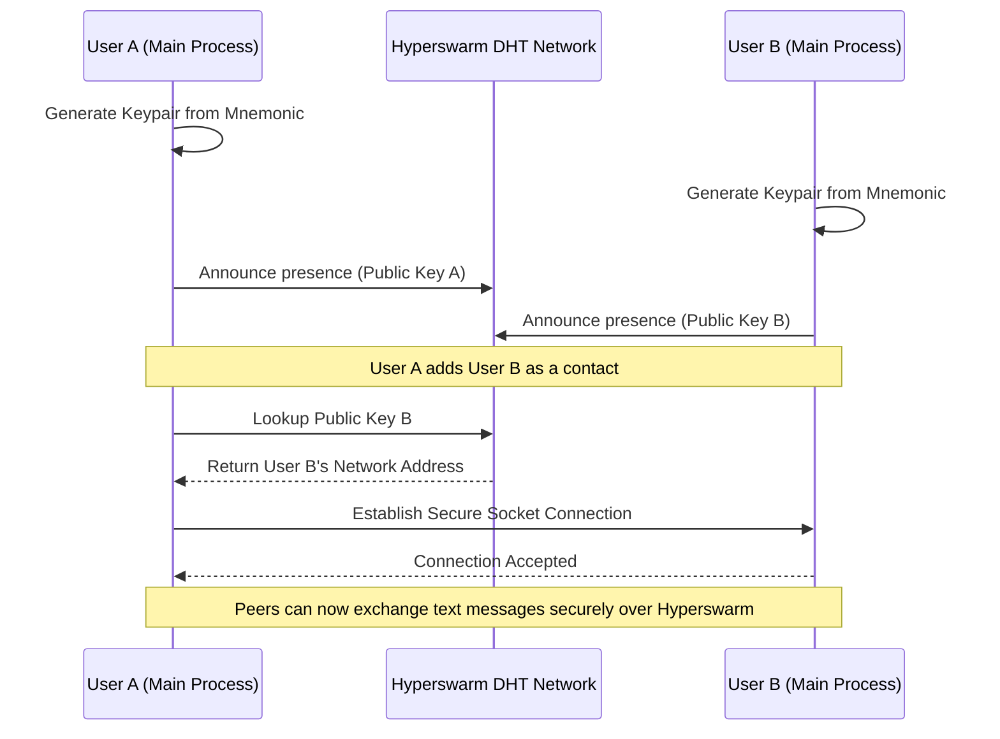

# A&Y Architecture & Developer Documentation

Welcome to the A&Y open-source repository! This document provides an overview of the application's architecture, technology stack, tools, and logic to help you get started with contributing.

## Overview
A&Y is a completely decentralized, serverless, peer-to-peer (P2P) messaging and video-calling desktop application. It runs locally without needing any central database to store user messages or data. Instead, users connect directly using cryptography and distributed hash tables (DHT).

## Tech Stack & Tools
- **Electron**: The core framework for the desktop application (macOS & Windows), utilizing Node.js for the backend (`main` process) and Chromium for the frontend (`renderer` process).
- **Hyperswarm**: Used for P2P network discovery and signaling. It creates a distributed hash table (DHT) network to find peers based on public keys and establishes secure, encrypted connections.
- **WebRTC (simple-peer)**: Used for establishing direct high-bandwidth connections between peers for Video Calling, Screen Sharing, and File Transfers.
- **IndexedDB**: Used on the frontend to persist data locally (Contacts, Chat History, Settings). No data ever leaves the device except when sent to a contact.
- **Vanilla JS / HTML / CSS**: The UI is built without heavy frameworks to keep the client lightweight, performant, and secure.

## Application Architecture

The application is split into two primary processes: **Main Process** and **Renderer Process**. They communicate via IPC (Inter-Process Communication).

### Main Process (`src/main.js`, `src/swarm.js`)
- Handles Window Management and OS-level integrations.
- Manages the **Hyperswarm network**. When the app starts, it initializes a Hyperswarm instance using the user's cryptographic seed (Mnemonic).
- Discovers peers and handles incoming/outgoing swarm socket connections.
- Securely stores the mnemonic in the OS's native keychain using `safeStorage`.

### Renderer Process (`src/renderer/app.js`, `src/renderer/p2p.js`)
- Handles the UI and user interactions.
- Stores chat messages and contacts locally in IndexedDB.
- **P2P Module (`p2p.js`)**: When the user initiates a video call or file transfer, the renderer coordinates with the main process to exchange WebRTC signaling data via the existing Hyperswarm connection. Once the WebRTC connection is established, video and files flow directly between the peers.

## Logic Flow Diagrams

### Peer Discovery & Connection Flow



### Video Call Signaling Flow (WebRTC over Hyperswarm)

Because WebRTC requires "signaling" (exchanging SDP offers/answers and ICE candidates), we use the existing Hyperswarm socket connection as our secure signaling server.

```mermaid
sequenceDiagram
    participant UI_A as User A UI (Renderer)
    participant Swarm_A as User A (Main)
    participant Swarm_B as User B (Main)
    participant UI_B as User B UI (Renderer)
    
    Note over UI_A,UI_B: User A initiates a Video Call
    UI_A->>UI_A: Create WebRTC Peer (simple-peer)
    UI_A->>UI_A: Generate WebRTC Offer (SDP)
    UI_A->>Swarm_A: IPC: send 'webrtc-signal'
    Swarm_A->>Swarm_B: Encrypted Socket: send offer
    Swarm_B->>UI_B: IPC: receive 'webrtc-signal'
    UI_B->>UI_B: User B accepts call
    UI_B->>UI_B: Create WebRTC Peer & Generate Answer
    UI_B->>Swarm_B: IPC: send 'webrtc-signal'
    Swarm_B->>Swarm_A: Encrypted Socket: send answer
    Swarm_A->>UI_A: IPC: receive 'webrtc-signal'
    
    Note over UI_A,UI_B: ICE Candidates exchanged similarly
    UI_A<-->>UI_B: Direct WebRTC Media Stream Established!
```

## Directory Structure
- `src/main.js`: Electron entry point, IPC handlers, permission management.
- `src/swarm.js`: Hyperswarm logic, P2P network discovery, signaling management.
- `src/preload.js`: Context bridge exposing safe IPC methods to the renderer.
- `src/renderer/`: Frontend logic.
  - `app.js`: Main UI initialization and event routing.
  - `p2p.js`: WebRTC and signaling wrapper for video and files.
  - `localDB.js`: IndexedDB wrapper for local storage.
  - `identity.js`: Mnemonic and cryptographic key generation.
  - `views/`: Specific UI components (Chat, Contacts, Video Call, Settings).

## Getting Started

1. Clone the repository and install dependencies: `npm install`
2. Run the application: `npm start`
3. To test with two instances locally:
   - Terminal 1: `npm start -- --user-data-dir=./test-data-1`
   - Terminal 2: `npm start -- --user-data-dir=./test-data-2`
4. Copy the Public Key from instance 1 and add it as a contact in instance 2 to test connections!
